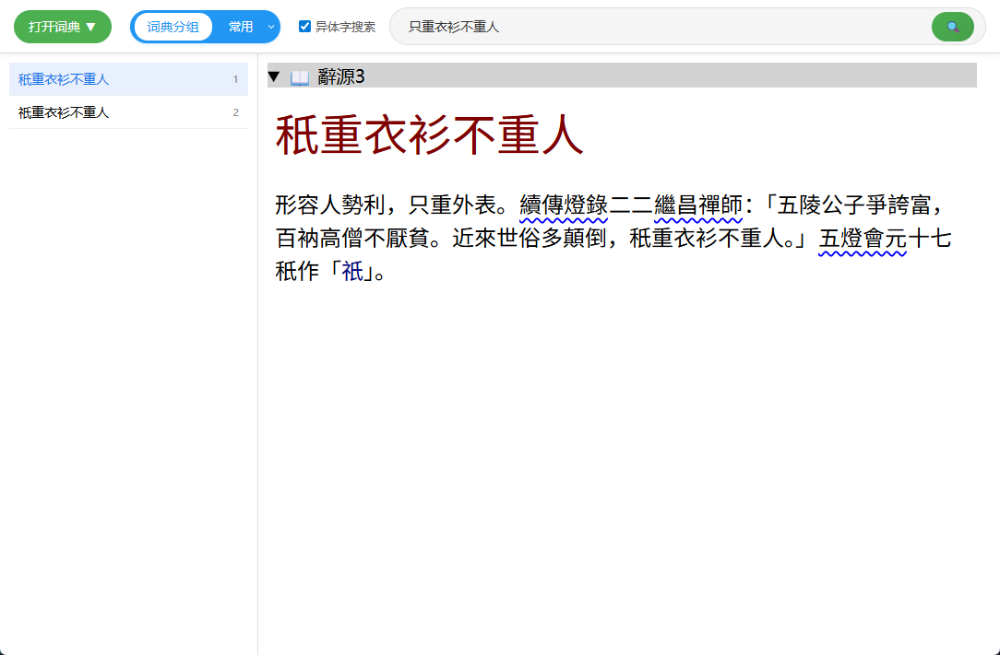
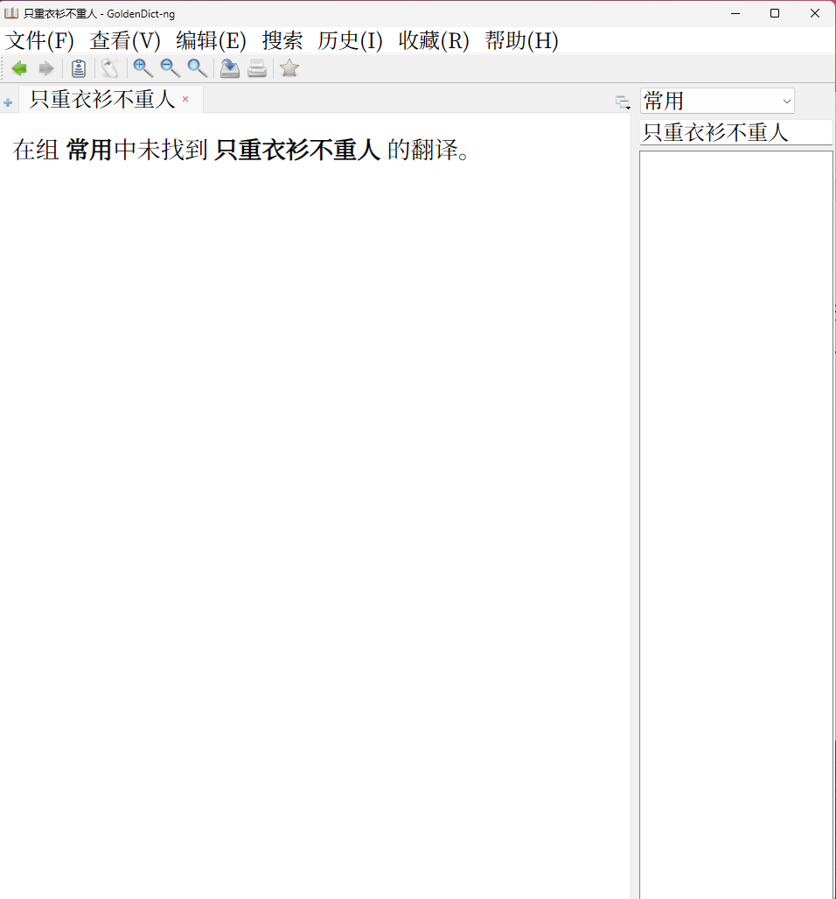
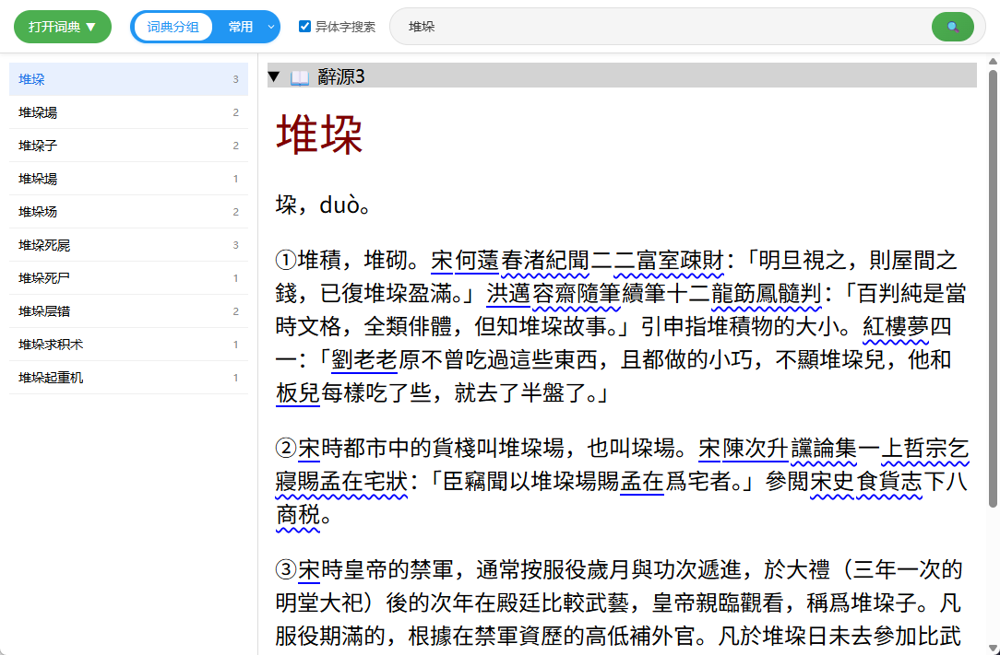
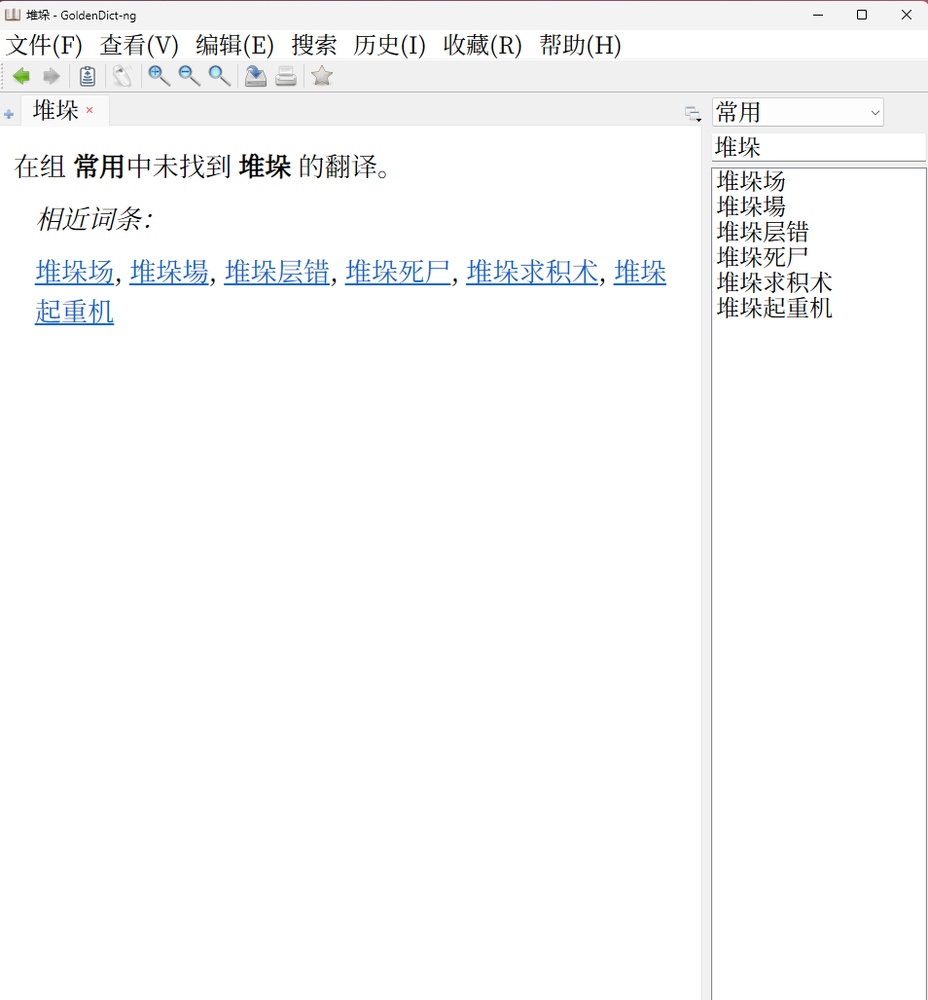
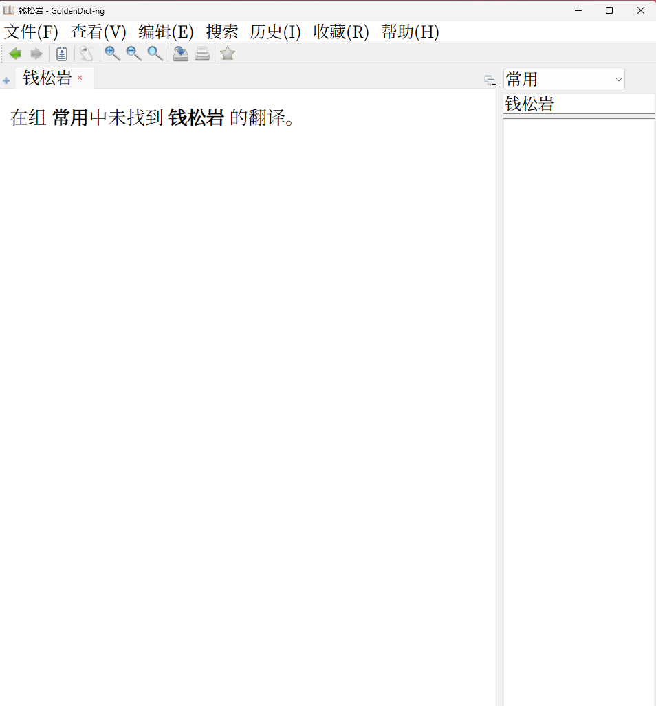
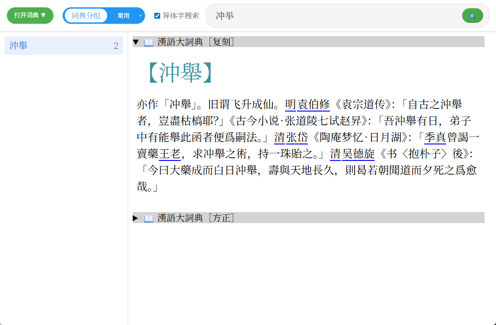
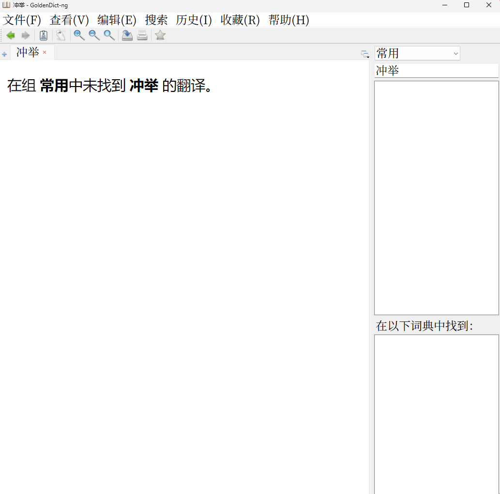

# ToyMDict
一个MDict玩具，用于查询mdx，mdd。

代码：智谱清言

参考：
1. https://github.com/raymanzhang/mdict
2. https://bitbucket.org/xwang/mdict-analysis/src
3. https://github.com/KnIfER/PlainDictionaryAPP

特点：
1. 支持异体字关联搜索（可自行修改`variants.json`，重启程序后生效）
2. 强制先分组，后查询
3. 支持多`mdd`文件
4. 不会占用`mdx`导致无法生成、解压文件
5. 支持自定义css（可自行修改`custom.css`，重启程序生效）

缺点：
1. 不支持标记语言
2. 缺少高级功能：如模糊搜索，全文搜索，页内搜索，查看源代码
3. 未考虑中文以外的语言
4. 不支持外挂字体（字体不在`mdd`内，与`mdx`在相同文件夹内）

与GoldenDict对比
1. 只重衣衫不重人

2. 堆垛

3. 钱松岩

4. 冲举

