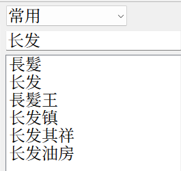
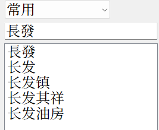
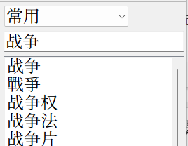
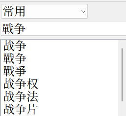

# ToyMDict
一个MDict玩具，用于查询mdx，mdd。

代码：智谱清言

参考：
1. https://github.com/raymanzhang/mdict
2. https://bitbucket.org/xwang/mdict-analysis/src
3. https://github.com/KnIfER/PlainDictionaryAPP
4. https://github.com/fengdh/mdict-js

特点：
1. 支持异体字关联搜索（可自行修改`variants.json`，重启程序后生效）
2. 强制先分组，后查询
3. 支持多`mdd`文件
4. 不会占用`mdx`导致无法生成、解压文件
5. 支持自定义css（可自行修改`custom.css`，重启程序生效）

缺点：
1. 不支持标记语言
2. 缺少高级功能：如模糊搜索，全文搜索，页内搜索，查看源代码
3. 未考虑中文以外的语言
4. 不支持外挂字体（字体不在`mdd`内，与`mdx`在相同文件夹内）

# Mdcit软件为什么选择ToyMDict？

项目地址：https://github.com/asgsdbrseg/ToyMDict

Mdict工具不乏其类，尤其是AI时代，更是井喷，为什么还要再做一个？

毫不客气地说，其他词典软件的初衷都是学习外语，只有ToyMDict是专为汉语开发的。

先说一下当前主流的词典软件的简繁实现和不足。

`Mdict`和`深蓝词典`把一对多腰斩了，「发」只和「發」对应，无论如何是搜不到「髮」的。

`平典`（又叫`无限词典`）倒是解决了一对多，它的问题是不支持扩展区汉字，也不能自定义。

`GoldenDict`和`DictTango`接入了opencc，局限也在于opencc。

首先，opencc的体量太小，《汉语大词典》收词37万，相较之下，opencc的体量可以忽略不计了。

其次，opencc对一对多的处理是默认返回第一个。这意味着所有包含「髮」的词组你要手动加入转换表，否则默认转换成「發」。

而一旦将含「髮」的词加入转换表，它就再也匹配不到「發」了。

第三，opencc以及主流的简繁转换本质都是「陆台转换」。opencc至今没有新字形的词表，所以你无法得到「戰争」。

诸位如果也使用以上软件，可自行验证我的说法。

即使opencc能完美解决简繁转换的问题，也不能解决词典搜索的问题。

「钱钟书」和「钱锺书」不是简繁关系，「説文」和「說文」也不是简繁关系。

opencc是输出工具，它需要精确。但搜索是输入工具，它不需要这种精确，只要在一组关键词中命中其中几个就行。

所以，我们看到古籍数据库没有只做简繁转换的，全部都是异体字关联。

转换和关联是不同的。

转换是单向的，简→繁，或繁→简。

关联是多向的，每个字都有简繁异多种形式，和其他字的简繁异多种形式任意组合。

ToyMDict也是相同的操作。在异体字表中加入这样的内容。

当你搜索「黄钟」时就会自动匹配2×4=8种组合。这和你手动搜索8种组合效果是一样的，软件唯一的作用是把手动变成自成。

当你收集了1万本词典，却查不到任何有效内容，等于白收集了，只是1万个占空间的垃圾。

查不到任何内容的GoldenDict

ToyMDict

这就是核心功能，至于操作方面，没有什么可设置的地方，只有两个按钮和一个搜索框。

一个导入词典，一个给词典分组，然后就可以搜索了，纯傻瓜式操作。
